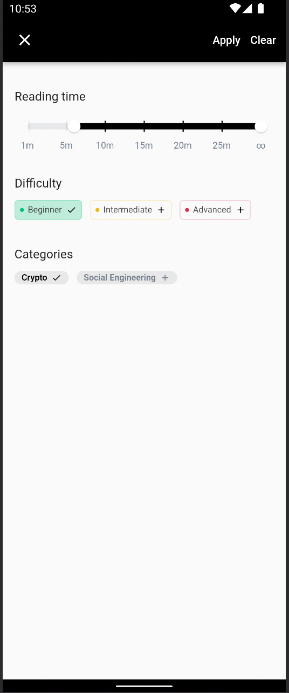

## Overview

A news display app built with Flutter

## Features
Its features include:
- Viewing news headlines
- Viewing news details
- Filtering news by difficulty, reading time, and category

## Screenshots
Home                                       | Details                        | Filter
:----------------------------------------: | :-----------------------------: | --------------------------- 
 |  | 

## Getting Started

#### Get dependencies
  
```
flutter pub get
```
#### Generate code
  
```
flutter pub run build_runner build --delete-conflicting-outputs
```

